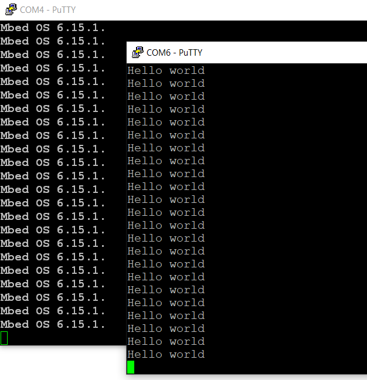

# USB CDC demo
## project name: mbed6_usbCDC
Tested by: **Keil Studio** 1.50 and **Mbed-OS** 6.15.1

The **USBCDC** class emulates a basic serial port over USB. You can use this serial port to send or receive data. 
If you want printf functionality then use the **USBSerial** class instead.

**Note:** Due to a compile error the original example had to be modified if we use Keil Studio. The ```strlen()``` 
function call was replaced with ```length()```, but the ```char_traits<char>``` 
traits class template sholud be also applied. 
Finally, insted of ```strlen(msg)``` we had to write ```std::char_traits<char>::length(msg)```. 

### Reference: 
[USBCDC example](https://os.mbed.com/docs/mbed-os/v6.15/apis/usbcdc.html) (Mbed official example)

## Hardware requirements
* NUCLEO-F446RE development board
* USB conncetor breakout for the STM32F446RE USBFS channel
* USB connection to a PC through the built-in ST-Link v2-1

## Wiring instructions for the NUCLEO-F446RE board

There is no USB connector for the USBFS channel of the target CPU therefore we have to prepare connection
by using an USB cable and an USB socket breakout card.

| USB breakout  | NUCLEO-F446RE pin   |
|:-------:|:-----: |
|  GND    |GND     | 
|  ID     | --     | 
|  D+     | PA_12  |
|  D-     | PA_11  | 
|  VBUS   | 5V     | 


## Software requirements
* Start with an empty mbed 6 project
* Edit the main.cpp source file
* Configure the project by adding an **mbed_app.json** file in which
    * We have to configure **usb_speedE** parameter
    * We have to add **USBDEVICE** to the device list of the target

Finally the **mbed_app.json** sholuld look like this: 

```
{
    "config": {
        "usb_speed": {
            "help": "USE_USB_OTG_FS or USE_USB_OTG_HS or USE_USB_HS_IN_FS",
            "value": "USE_USB_OTG_FS"
        }
    },
    "target_overrides": {
        "*": {
            "target.device_has_add": ["USBDEVICE"]
        }
    }
}
```
## mbed6_usbCDC results
Open two terminal windows on the PC. One for the ST-Link v2-1 and the other for the target MCU USB connection.
The default baudrate is 9600 bps for the ST-Link virtual serial port. 
The other virtual serial port does not need baudrate setting.
After (re)starting of the program you should se the following output:



